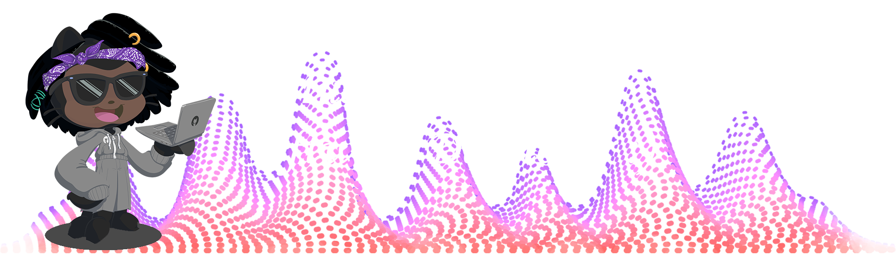

# Hi there, I'm Keean Smith 👋

Welcome to my GitHub profile! I'm a passionate Computer Science student graduating in **December 2024**. Here's a little bit about me:

---

### 🔭 **What I'm Currently Working On**
- Furthing my algorithmic thinking with LeetCode.
- Getting into game development in order to solidify my design principles.
- A web app that can search for YouTube videos via video length.

---

### 🛠️ **Tech Stack**

#### **Languages**

#### **Tools & Frameworks**

---

### 🌟 **Highlights & Interests**
- 💻 Deeply invested in solving **complex algorithmic challenges**.
- 🌐 Passionate about exploring **new technologies** like AI.
- 🧑‍🎓 Committed to **continuous learning** through personal projects.
- 🎶 Enjoy producing music from my desktop (FL Studio is the best DAW 😉).

---

### ✨ **Fun Facts**
- 🎹 I just finished learning **Clair de Lune** on the piano and it's so fun to play.
- 🎮 Absolute gamer who loves single-player adventures, especially **The Legend of Zelda: Breath of the Wild**.
- 🏋️‍♂️ I finally hit a 225 bench this year!

---

### 📫 **Connect with Me**

)

---

### 💡 **Favorte Quote**
> “The reality is, I’ll be 32 in 4 years no matter what. The question is, do I want to be 32 with an MD or without one?”  - Alok Kanojia

---
